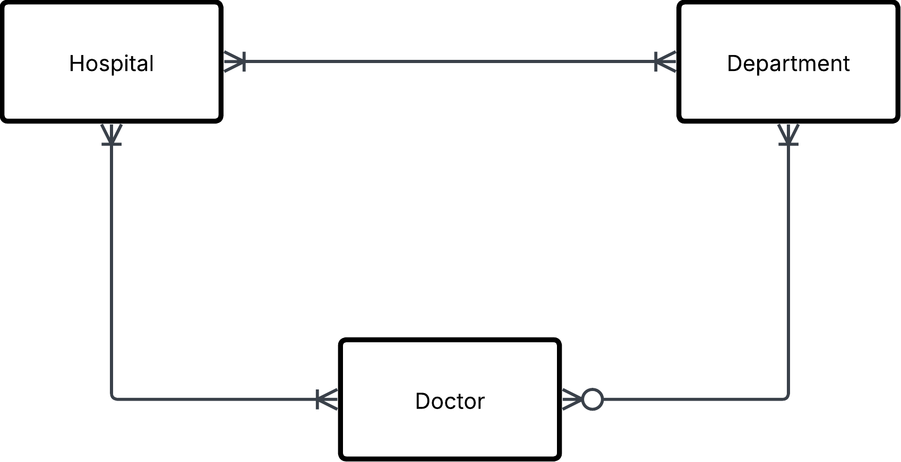

# Exercise 0

## 1. Hospital task

Do this manually and not programmatically.

```json
{
  "hospital": "Sjukhusstock",
  "address": "Drottninggatan 3, Stockholm",
  "departments": [
    {
      "name": "Kardiologi",
      "doctors": [
        { "id": 1, "name": "Dr. Abra Abrahamson" },
        { "id": 2, "name": "Dr. Erika Eriksson" }
      ]
    },
    {
      "name": "Neurologi",
      "doctors": [{ "id": 3, "name": "Dr. Sven Svensson" }]
    }
  ]
}
```

### Solution

- Identyfy entities
- Identyfy

**Initial tables**



Hospital

| hospital_id | name         | adress           |
| ----------- | ------------ | ---------------- |
| 1           | Sjukhusstock | Drottninggatan 3 |

Department

| department_id | name       |
| ------------- | ---------- |
| 1             | Kardiologi |
| 2             | Neurologi  |

Doctor

| doctor_id | first_name | last_name  |
| --------- | ---------- | ---------- |
| 1         | Abra       | Arbahamson |
| 2         | Erika      | Eriksson   |
| 3         | Bob        | Bobson     |

Refined with brige table to reflect meny-to-meny relationships


Hospital/department

| hospital_department_id | hospital_id | department_id |
| ---------------------- | ----------- | ------------- |
| 1                      | 1           | 1             |
| 2                      | 1           | 2             |

Hospital / Doctor

| hospital_doctor_id | hospital_id | doctor_id |
| ------------------ | ----------- | --------- |
| 1                  | 1           | 1         |
| 2                  | 2           | 1         |
| 1                  | 1           | 2         |
| 2                  | 2           | 3         |

Doctor / Department

| doctor_department_id | doctor_id | department_id |
| -------------------- | --------- | ------------- |
| 1                    | 1         | 1             |
| 2                    | 1         | 2             |
| 3                    | 2         | 1             |
| 4                    | 2         | 2             |

Test a join
Want the information
TODO: Create this SQL query

```SQL
SELECT
h.name,
h.city,
d.name
FROM main.hospital_department hd
INNER JOIN main.hospital h on h.hospital_id = hd.hospital_id
INNER JOIN main.department d on d.department_id = hd department_id;
```


## 2. Library Bookly

a, Identify the entities and attributes for each entity.

    - Book
    name, title, ISBN, Förfatare
  
    - Menbers
    member_id, first_name, last_name, phone, adress, email


> [!NOTE]
> ISBN är ett unikt nummer för böker. Som skulle kunna andvänds som `primery key`, detta gör det till en `natural key`

b, Determine the relationship between member and books.

    One-to-meny

    Member kan ha 0 eller flera lån
    En Book kan vara utlånad till noll eller en Member

c, Draw a conceptual ERD using crow foots notation.


## 3. Conceptual ERD to words
a, Describe the entities in this conceptual ERD.

    Customer = Person som kan hyra en bil

    Cars = Bilar som kan bli hyrda en personer  

    Rental(composite entity) = Transaktion mellan en Customer och Car

b, Write out the relationship labels.
    
    Custumer till rental = makes
    rental till car = contanes 

c, Describe the relationships between the entities (one-to-many, one-to-one and many-to-many).
    
    Customer to Rental: One-to-Meny
    Rental to Customer: Meny-to-One
    Reantal to Car: Meny-to-one
    Car to Rental: One-to-Meny

d, Define the relationship statement for example: "A Customer can have one or more Rentals".

    Customer: Kan ha en eller flera Rentals 

    Rental: Kan koppas till en och bara en Custumer

    Rental: En bil kan koppas till en och bara en Rental

    Car: En eller flera rentals kan koppas till samma bil. 

## 4. Online store
a, Identify entities and their relationships
b, Create a conceptual ERD with cardinalities


## 5. University management system
a, Identify entities and their relationships

    Student
    Student_id, firstname, lastname
    
    Course
    Kurs_id, course_name, Course_classroom

    Proffesor
    proffesor_id, firstname, lastname

b, Come up with possible attributes for the entities

student
| student_id, | student_name | student_lastname |
| ----------- | ------------ | ---------------- |
| 1           | Bob          | Bobsson          |
| 2           | Sve          | Svensson         |

Course
| course_id, | course_name | proffesor_id |
| ---------- | ----------- | ------------ |
| 1          | Svenska     | 1            |
| 2          | Engelska    | 2            |

| proffesor_id, | proffesor_name | proffesor_lastname |
| ------------- | -------------- | ------------------ |
| 1             | Olle           | Olsson             |
| 2             | Erik           | Eriksson           |

c, Draw conceptual ERD with cardinalities


d, Define business rules (e.g. a student can enroll in max 4 courses)

    Om en kurs inte har några elever finns inte kursen. 

    En Student måste gå på en kurs för att vara en studnet. 

## 6 Onshop
a, Identify key entities and their attributes (e.g., customer_name, order_date)

customer
| customer_id, | customer_name | customer_lastname |
| ------------ | ------------- | ----------------- |
| 1            | Bob           | Bobsson           |
| 2            | Sve           | Svensson          |

order
| order_id, | customer_id | order_product | order_amount | order_price |
| --------- | ----------- | ------------- | ------------ | ----------- |
| 1         | 1           | Hoodie        | 5            | 1000        |
| 1         | 1           | jeans         | 2            | 1200        |

| order_product_id | order_id | product_id |
| ---------------- | -------- | ---------- |
| 1                | 1        | 1          |
| 2                | 1        | 2          |


product
| product_id, | product_name | product_price |
| ----------- | ------------ | ------------- |
| 1           | Hoodie       | 200           |
| 2           | Jeans        | 600           |

| product_category_id | category_id | product_id |
| ------------------- | ----------- | ---------- |
| 1                   | 1           | 1          |
| 2                   | 2           | 1          |
| 3                   | 2           | 2          |
| 4                   | 3           | 2          |

category
| category_id, | category_name |
| ------------ | ------------- |
| 1            | Byxor         |
| 2            | Tröjor        |


b, Sketch the conceptual ERD.


c, Define business rules
