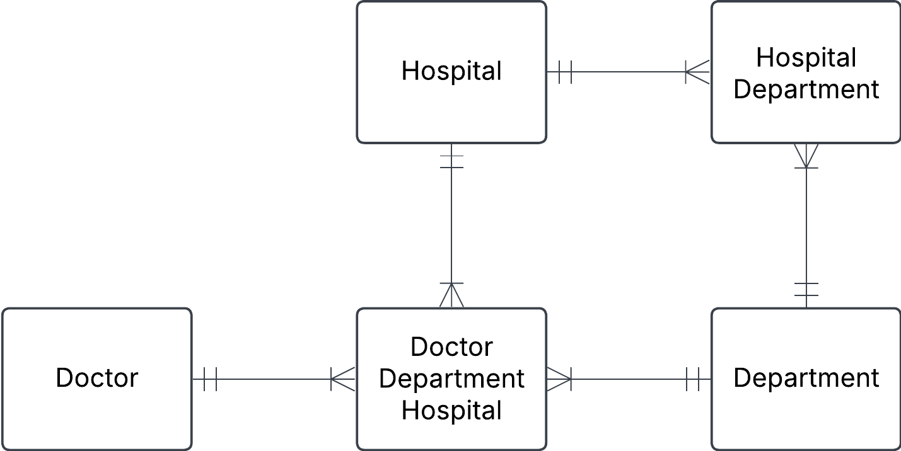

# 0. Ezecream orders
| order_id | order_date | customer_id | customer_name  | customer_address | product_id | product_name | quantity |
| -------- | ---------- | ----------- | -------------- | ---------------- | ---------- | ------------ | -------- |
| 101      | 2024-04-05 | 05          | Ragnar Lodbrok | Kattegatt 3      | 3          | Blåbärsmagi  | 20       |
| 101      | 2024-04-05 | 05          | Ragnar Lodbrok | Kattegatt 3      | 5          | Lakritsdröm  | 15       |
| 101      | 2024-04-05 | 05          | Ragnar Lodbrok | Kattegatt 3      | 1          | Lichipichi   | 35       |
| 105      | 2025-01-10 | 15          | Feliz Fernadu  | Madridugatan 2   | 8          | Gitlass      | 30       |
| ...      | ...        | ...         | ...            | ...              | ...        | ...          | ...      |

a) Find different problems with this table, so that Ezecream will take you in for internship to fix it for them

    - Allt är i samma table.
    - Saknas pris
    - Duplicerad data (Rangnar)

b1) Does this table satisfy 1NF, 2NF? Motivate.

    - Följer 1NF men följer inte 2NF.
    - Primery key måste bero på allt i tablet och i detta fall gör det inte det. 

b2) Normalize this table to 3NF, make conceptual diagram and relational schema notation for each relation. Relational schema notation is RelationName(attribute1, attribute2, ...)

    Customer
    | customer_id | name          | adress      |
    | ----------- | ------------- |-------------|
    | 1           | Bob Bobsson   | stenvägen 5 |
    | 2           | Sven Svensson | Grusvägen 4 |

    Order
    | order_id | order_date | customer_id |
    | -------- |----------- | ----------- |
    | 1        | 2023-10-31 | 1           |
    | 2        | 2023-10-31 | 1           |
    | 3        | 2025-03-10 | 2           |

    Orderline
    | order_id | product_id | quantety |
    | -------- |----------- | -------- |
    | 1        | 2          | 95       |
    | 2        | 1          | 20       |
    | 3        | 3          | 50       |
    
    Product         
    | product_id  | product_name   |
    | ----------- | -------------- |
    | 1           | Vaniljglass    |
    | 2           | Jordgubbsglass | 
    | 3           | Blåbärsglass   | 

c) Now also add price attribute. Think about what would happen when price increases or decreases.

        Om Price läggs till som en attredute så kommer priset ändra alla tidigare ordrar till det nya priset. Då måste man lägga till en ny Entety

d) Write SQL code to get the total price for Ragnar Lodbrok. Insert data into your tables and test it out.

## 2. Revisiting the doctor example

a) Does the design fulfill 3NF, motivate based on the rules for the normal forms.

    ja, Denna är 3NF. Baserat på att hospital adress är bara en gatauadress och inte en grupp men adress, postkod, stad osv...

b) You should have realised from this question in exercise1 0e)that this creates ambiguity. This can be solved with a ternary relationship, which connects three entities simultaneously. Now make a new iteration for this data model.

Hospital

| hospital_id | name         | adress           |
| ----------- | ------------ | ---------------- |
| 1           | Sjukhusstock | Drottninggatan 3 |
| 2           | SÖS          | Skjukhusbacken 10|

Department

| department_id | name       |
| ------------- | ---------- |
| 1             | Kardiologi |
| 2             | Neurologi  |

Doctor

| doctor_id | first_name | last_name  |
| --------- | ---------- | ---------- |
| 1         | Abra       | Arbahamson |
| 2         | Erika      | Eriksson   |
| 3         | Bob        | Bobson     |

Hospital/department

| hospital_department_id | hospital_id | department_id |
| ---------------------- | ----------- | ------------- |
| 1                      | 1           | 1             |
| 2                      | 1           | 2             |

Doctor / Department / Hospital

| doctor_department_hospital_id | doctor_id | department_id | hospital_id |
| ----------------------------- | --------- | ------------- | ----------- |
| 1                             | 1         | 1             | 1           |
| 2                             | 1         | 2             | 2           |
| 3                             | 2         | 1             | 2           |
| 4                             | 2         | 2             | 1           |

c) In your design do you have bridge tables as well in addition to the ternary relationship. Motivate why you should or should not have them.